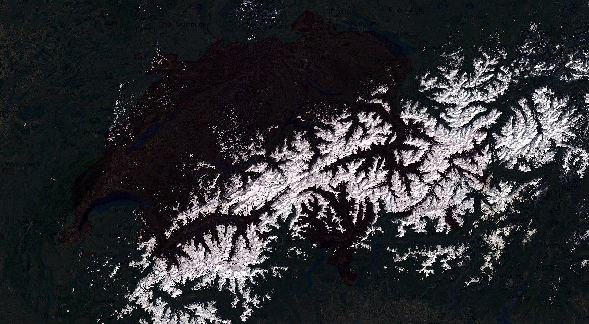
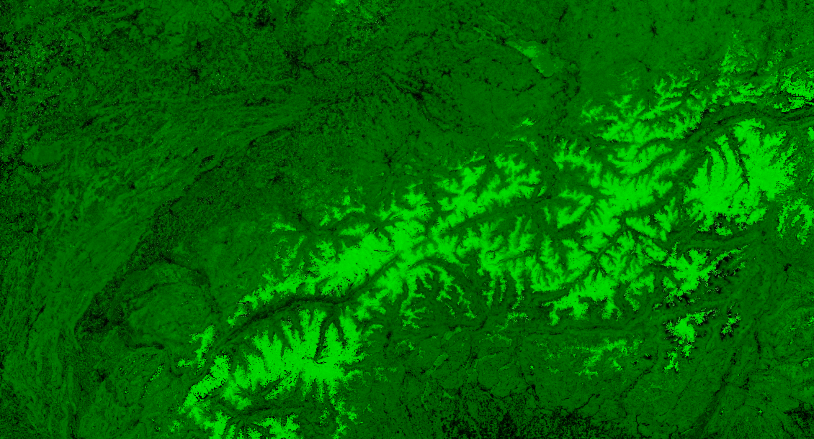
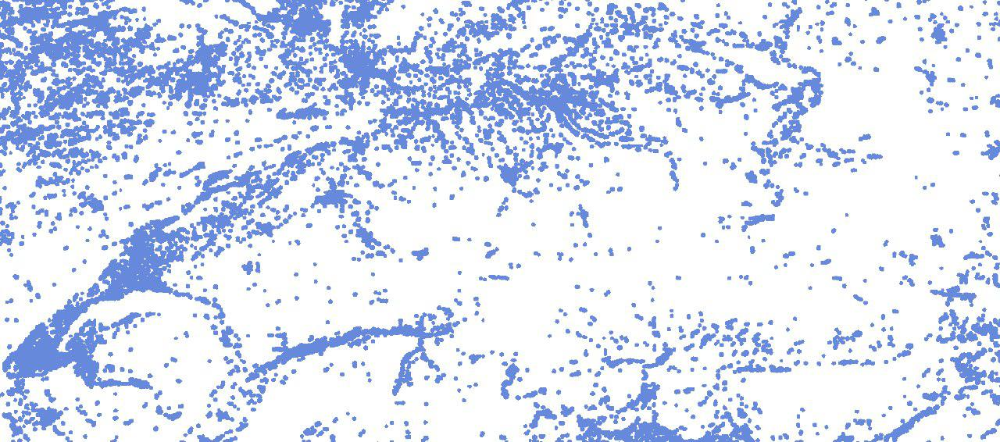
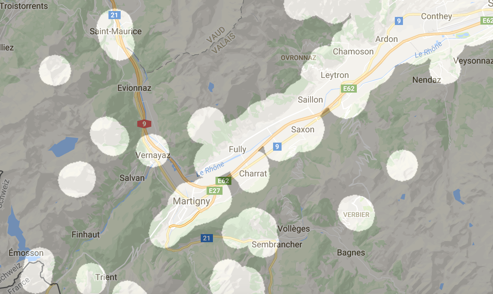
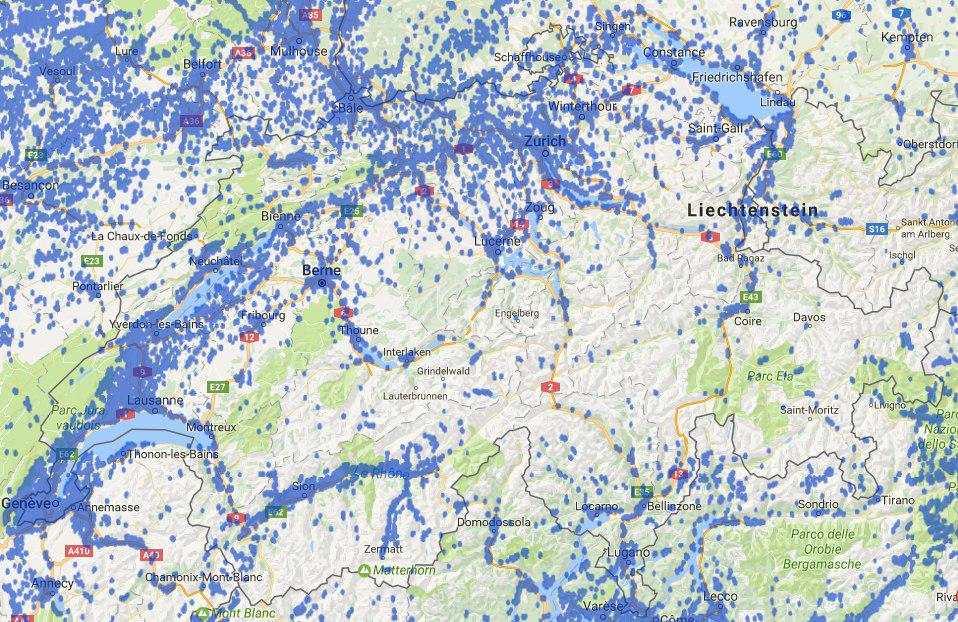

# ADA-Project - Temporal analysis of networking activity in non-urban points of interest in Switzerland

## Results

The results of this projects are presented as a Javascript Interface that can be found in the folder website/results, or directly seen on this [link](http://nathanquinteiro.azurewebsites.net/ada/index.html)

## Prerequesites

If you wish to run the notebook of this repository, you will have to download the full data zup that can be found on this [link](https://drive.google.com/open?id=0BxIBGCVqTlDmRUJSaUZRR3J5Nk0). Download it and uncompress it at the root of the folder "data".

## Abstract

The idea of this project is to find, based on social networks data and satellite imagery, the non-urban points of interest in Switzerland. What we mean by *non-urban point of interest* is a place located in a low to zero built environment density, which experience a relatively high social network activity  

More concretely, we want to focus on places in the nature that generate network activity, rather than places in the cities or villages.

## Data choice

We will focus on Switzerland Tweeter data mainly because it is a very popular and active social network in Switzerland and it provides geolocation of the tweets, which is necessary to establish a map of the places of interest precisely.

*The data in hadoop fs format can be found on EPFL cluster on **/datasets/twitter-swisscom/twex.tsv**.*

## Urban area detection

To determine the urban and non-urban area in Switzerland, we use Landsat-8 satellite images, and compute the NDBI (Normalized Difference Built-up Index), using the SWIR and NIR bands of the satellite images. The image bellow presents the map of Switzerland supperposed with the raw image of satellite :

  
  <figcaption align="center"></figcaption>

We use Landsat-8 satellite images NIR (Near-infrared 0.75–1.4 µm) and SWIR (Short-wavelength infrared 1.4–3 µm) bands to compute NDBI (Nomalized Difference Built-up Index) :

    NDBI = NIR – SWIR / ( NIR + SWIR )
NDBI image obtained, black dots are urban area :

  
  <figcaption align="center"></figcaption>

 We then apply filters and morphological operators on the NDBI image to produce a urban mask that will let us differentiate urban and non-urban location and therefore discard the urban tweets.

The figure bellow present the mask obtained from your morphological operation applied on the NDBI. The blue dots are the urban areas.

 
 <figcaption align="center"></figcaption>

Zoom on the mask for the Martigny region :

 

   
   <figcaption align="center"></figcaption>

 

We used Google Earth Engine code editor to produce the NDBI for Switzerland and export the urban mask. The mask obtained superposed to the map of Switzerland :

  
  <figcaption align="center"></figcaption>

*The Google Earth engine code cand be found in the script [google_earth_NDBI.js](google_earth_NDBI.js "NDBI for Switzerland on Google Earth Engine"). The generated mask in TIFF format can be found in [data/urban_mask.tif](data/urban_mask.tif "TIFF urban mask")*.

## Data processing

*The data cleaning and processing is done in the notebook [DataCleaning_Urbanization.ipynb](DataCleaning_Urbanization.ipynb "Data Cleaning and processing")*

The notebook produces one tsv files that is used by further Notebook (Clustering.ipynb):
* data/cleaned_non_urban.tsv: Which contains all information about the non-urban tweets, their id, date and position.

### Filtering of the data

To focus on tweets that are located in non-urban areas, we therefore apply the urban-mask on all tweets, and discard the non-urban tweets.

*Urban areas represents about 76% of the overall area, but only 9.5% of the tweets (~1.2 Millions of tweets).*

## Clustering

*The clustering of the tweets is done in the notebook [Clustering.ipynb](Clustering.ipynb "Clustering")*

The notebook produces two tsv files that are used by further Notebook (Cluster_analyze.ipynb):
* data/cleaned_non_urban_with_clusters_dbscan.tsv: Which contains all information about the non-urban tweets, their id, date, position, and the cluster they belong to.
* data/clusters_centers_dbscan.tsv: Which contains the position of the clusters

To obtain meaningfull informations about the tweets distribution, the remaining tweets are gathered in different clusters based on their location. To perform this task, the DBSCAN algorithm is run on the data.

### Subset

Since DBSCAN implementations on sklearn requires a lot of memory, it can not be run on the ~1.3 millions tweets remaining. We therefore create a random subset of 200'000 tweets to form clusters.

### Cluster assignement

Using the clusters computed with the subset, we then ran a method computing the distance from each cluster center to each tweets, and assigned each tweets to the closest cluster. The tweets with no cluster closer than ~10km were considered part of no cluster and discarded.

## Cluster Analysis

*The clusters analyis is done in the notebook [Cluster_analyze.ipynb](Cluster_analyze.ipynb "Cluster_analyze")*

The notebook produces two javascript files that are used by our javascript interface to present the results :
* data/cities.js: Which contains a javascript array with all the areas of interest (name, location)
* data/datas_dbscan.js: Which contains the number of tweets per day in each area of interest

### Grouping

We started by grouping the tweets by cluster (point of interest), this help us to determine what are the non-urban area with high tweeter activiy.

### Discarding

We realized that some cluster are outside of switzerland, because the base data contains tweets from Germany, France and Italy. We therefore created method to check if a cluster is located outside of Switzerland's borders and choose to discard them when it is the case.

### Getting the address

We chosed to keep only the cluster with more than 5000 tweets overall. In order to display the results in a more human-readable way, we used Geopy to reverse the location and find the corresponding adress of the place of the cluster.

### Result export

We chosed to export the result as Javascript array, in order to integrate them easily in our Javascript interface. [website/results/index.html](website/results/index.html "website/results/index.html")
